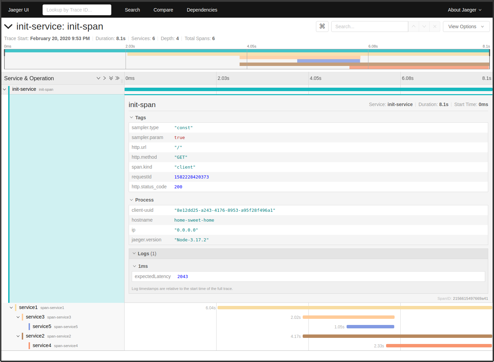
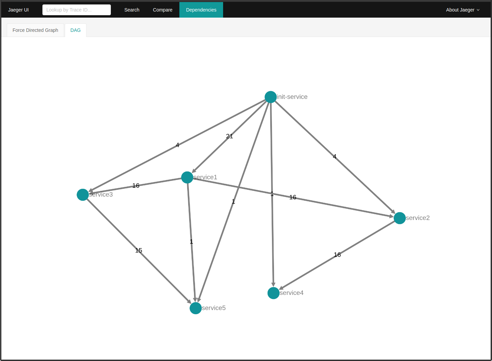
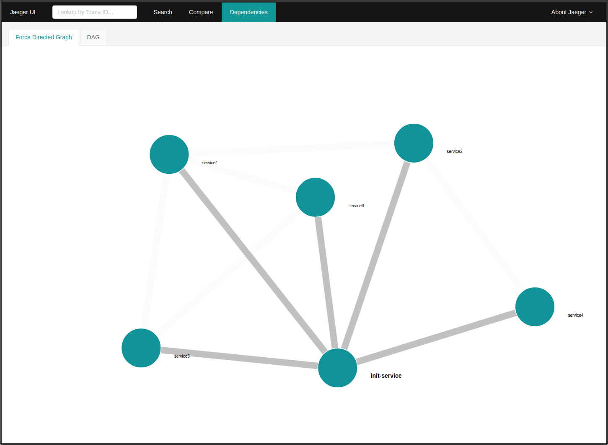

# Using Jaeger with your Node.js micro-services

## My motivation for creating this repository 😺

So you are into micro-services and you already found about [OpenTracing](https://opentracing.io) and you want to use that fancy [JaegerUI](https://jaegertracing.io/) to see what is really going on between your micro-services. You already noticed that there are not many examples out there about jaeger and node.js. I hear you! This is why I created this repository, I want to help you understand how multi-micro-service tracing works with Jaeger.

You will learn how your tracers in your micro-services inject 💉 and extract 👀 headers.

## Requirements 📝

- [Node.js](https://nodejs.org/en/about/releases/) Active LTS recommended
- [PM2](https://pm2.keymetrics.io/) To start multiple node.js instances easily
- [Jaeger All in One Docker Image](https://www.jaegertracing.io/download/#docker-images) To setup a jeager collector in your local environment

## How to setup all of these and make it work ✨

1. Install prerequisites
    - Make sure you have installed Node.js and Docker
    - Install PM2 globally

      ```bash
      npm i -g pm2
      ```

    - Run Jaeger All in One Docker Image

      ```bash
      docker run -d --name jaeger \
      -e COLLECTOR_ZIPKIN_HTTP_PORT=9411 \
      -p 5775:5775/udp \
      -p 6831:6831/udp \
      -p 6832:6832/udp \
      -p 5778:5778 \
      -p 16686:16686 \
      -p 14268:14268 \
      -p 9411:9411 \
      jaegertracing/all-in-one:1.8
      ```

1. Run the example project
    - Clone this repository

      ```bash
      git clone git@github.com:algun/jaeger-nodejs-example.git
      ```

    - Change your directory into the project

      ```bash
      cd jaeger-nodejs-example
      ```

    - Install packages

      ```bash
      npm i
      ```

    - Use PM2 to start up all your services

      ```bash
      pm2 start
      ```

    - Use PM2 to watch project logs

      ```bash
      pm2 logs
      ```

1. Visit your initial endpoint to create traces between all services
    - [http://localhost:3000](http://localhost:3000)

1. Visit your local JaegerUI to enjoy your micro-service trace visualizations
    - [http://localhost:16686/](http://localhost:16686/)

1. Enjoy these views
    
    
    

## Understanding how it works ✨

Here are some key points to understand how this project instruments these services with jaeger:

- Check `ecosystem.config.js` file to see how service names and ports are defined
- Pay attentions to `tracer.inject()` and `tracer.extract()` commands to understand how the spans flow into another service via http headers.
- Notice that `init-service` has only `tracer.inject()` since it is the firelight of our multi-micro-service calls.
- Notice that ~~`service4`~~ and `service5` have only `tracer.extract()` since they are the end of the line for our micro-service structure in this example.
- Notice that `service4` still injects its headers with `tracer.inject()` but it makes no sense since it will not create request any further within this project.

### Feel free to comment / give feedback ❤️

This is my humble attempt to help people out who is struggling to understand tracing concept between micro-services.
